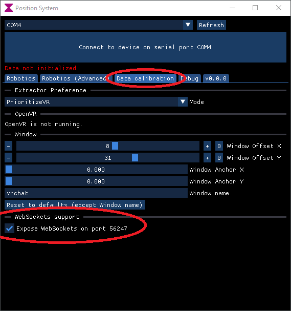

import {HaiTags} from "/src/components/HaiTags";
import {HaiTag} from "/src/components/HaiTag";
import {HaiVideo} from "/src/components/HaiVideo";

# Developer documentation

Most of the documentation of this website is meant for users of the application.

If you are a developer, you should consult the [README.md on GitHub](https://github.com/hai-vr/position-system-to-external-program/)
for technical information about the extraction process, the shader, the WebSockets API, and the camera position extraction.

:::info
If you made it this far into this documentation, you may want to know there is a **new temporary Discord server** here for early troubleshooting:
https://discord.gg/3VzveJQYWE
:::

## Adding support for other robotic arms

Are you a developer looking to connect an unsupported robotic arm? [Check out the GitHub](https://github.com/hai-vr/position-system-to-external-program/).
- [The **Submit()** function](https://github.com/hai-vr/position-system-to-external-program/blob/main/application-loop/Routine.cs) in `Routine.cs` is probably a good place to start.

## WebSockets

<HaiTags>
<HaiTag requiresResonite={true} short={true} />
<HaiTag requiresBasis={true} short={true} />
</HaiTags>

If you are using *Resonite*, or if you are modifying *ChilloutVR*, or if you are making an application built using the Basis framework,
you should probably use [WebSockets](https://github.com/hai-vr/position-system-to-external-program/?tab=readme-ov-file#websockets-as-an-alternative-input-system).

In the *Data calibration* tab of the software, at the bottom in the *Resonite WebSockets* section, check the box to enable the WebSocket service.



You can find the [WebSockets message specification here](https://github.com/hai-vr/position-system-to-external-program/?tab=readme-ov-file#websockets-as-an-alternative-input-system):

> If *WebSockets* support is enabled, we will expose a websocket on port **56247** at url `ws://localhost:56247/ws`
> 
> Send the following string to it that represents an interpreted position and normal:
> ```text
> PositionSystemInterpreted PositionX PositionY PositionZ NormalX NormalY NormalZ
> ```
> - *PositionX*, *PositionY*, *PositionZ* is the position in local space, where (0, 0, 0) is the bottommost center, and (0, 1, 0) is the uppermost center.
> - *NormalX*, *NormalY*, *NormalZ* is the direction, represented as a vector of length 1. It doesn't matter if you don't make it length 1, we will normalize it anyway.
> 
> While you're at it, you can also submit the tangent, which can be useful to define the twist, but this is optional:
> ```text
> PositionSystemInterpreted PositionX PositionY PositionZ NormalX NormalY NormalZ TangentX TangentY TangentZ
> ```
> - *TangentX*, *TangentY*, *TangentZ* is the tangent (which is a vector perpendicular to the direction), represented as a vector of length 1. It doesn't matter if you don't make it length 1, we will normalize it anyway.
