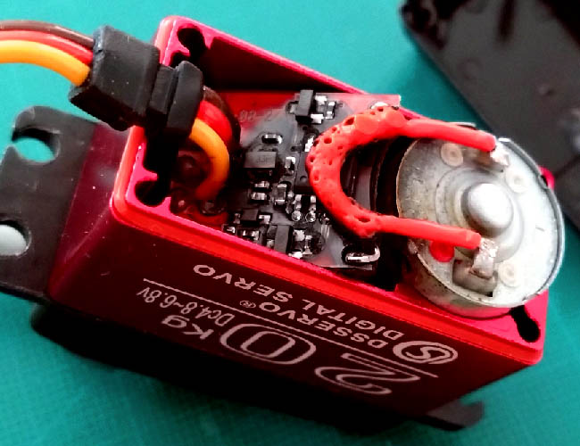
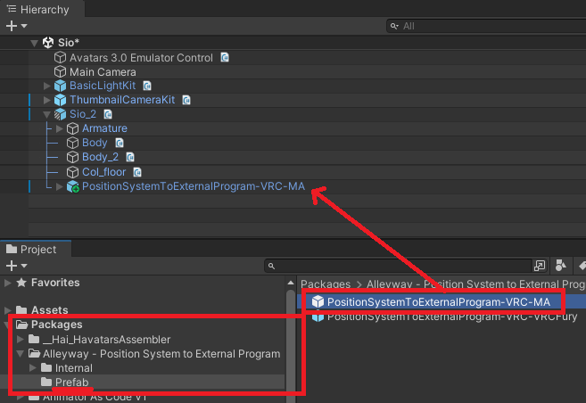
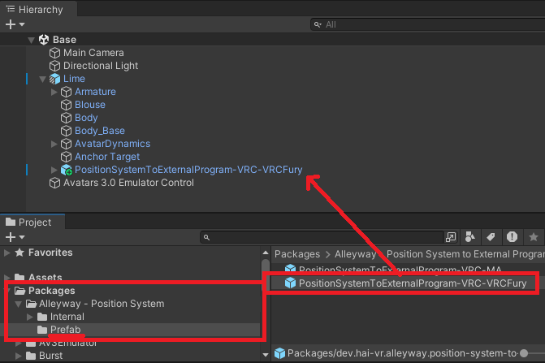
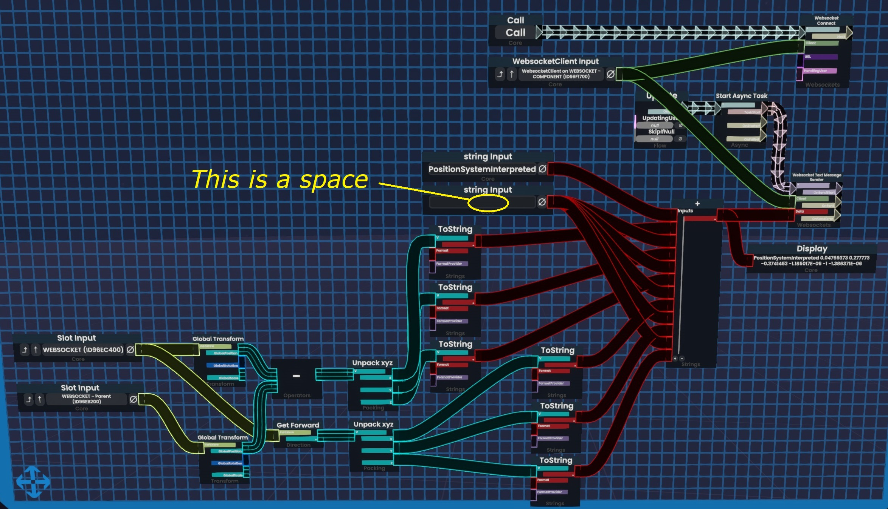

---
title: "Position System to External Program"
---
import {HaiTags} from "/src/components/HaiTags";
import {HaiTag} from "/src/components/HaiTag";
import {HaiVideo} from "/src/components/HaiVideo";

<HaiTags>
<HaiTag requiresResonite={true} short={true} />
<HaiTag requiresVRChat={true} short={true} />
</HaiTags>

*Position System to External Program* is a **shader** and a **program** that lets you connect the position of standard DPS-like lights
to a robotic arm.

Other users may be able to remotely control the position and rotation of your robotic arm through a shared virtual space.

:::warning
**This document is a draft and may be incomplete.**

This application is planned for release sometime in August, so check this documentation again in a few days.
:::

This is achieved by encoding pixels to the window screen or the image that is projected into the HMD. Our program then reads those pixels. 
Data extraction is done using **harmless screen capture** techniques similar to window and VR live-streaming.
There is no tampering of the computer program nor any active process. There is no OSC either.

In addition:
- The position and rotation of the camera in world space is also extracted. This could be used to pin SteamVR overlays in world space.
- This optionally exposes a WebSocket service to enable direct control of the robotic arm from virtual space systems like Resonite.

<HaiVideo src="./img/ILX73J2vHu-f.mp4"></HaiVideo>
*The data extraction method is similar to screen captures, which is completely harmless.*

## Robotic arms

As of currently, this software is known to function with the following robotic arms:

| Vendor      | Model | Protocol | Communication mode | Tested |
|-------------|-------|----------|--------------------|--------|
| Tempest MAx | SR6   | T-code   | Serial port        | ❓️     |
| Tempest MAx | OSR2  | T-code   | Serial port        | ❓      |

Wireless is not yet supported, as we do not currently have contributing developers who own such a device.

*If you are a developer, you may be able to add wireless support yourself. This project is released under the MIT License.*

## ⚠️ Safety warning

Normally, robotic arms for domestic use are traditionally controlled using mathematical algorithms that produce smooth curves, which ensures that
the motion of the robotic arm is comfortable and relatively free of haphazard motions.

However, **this is NOT the case with this software**. Instead of mathematical algorithms, the robotic arm is controlled by a shared virtual space,
which is an imperfect system.

When using a position system through a shared virtual space, **the motion of the robotic arm will not benefit from these safeties**.
Carefully consider the following risks:
- If the entity or person controlling the position of your robotic arm suffers from loss of tracking, the robotic arm may treat that loss of tracking as a position to reach.
- If the entity or person controlling the position of your robotic arm moves too fast, the robotic arm may attempt to reach that position faster than the motors are capable of.
This will result in unexpected angles from your robotic arm during the travel. The more degrees of freedom your device has, the more likely this is going to happen.
- In addition, the firmware and hardware will be subjected to positions that may be considered unusual by traditional software, and therefore those positions may be less tested.
These unusual positions could cause damage to your robotic arm or reveal bugs in the firmware that may compromise the expected position of the robotic arm.

If you choose to use a robotic arm in a shared virtual environment, be responsible and **communicate thoroughly to ensure a safer experience
for all parties**.

**You are solely responsible for your own personal safety.**

## ⚠️ Fire hazard

Some low-quality servos can burn out and short-circuit closed, causing parts of the robotic arm to heat up even beyond the glass transition temperature 
of some 3D-printed materials. This can pose a fire hazard.

Keep an eye out on your device and **power it off when not in use**. Do not fall asleep while your device is still powered on.

:::danger
If you're going to build your own robotic arm, **do not buy any of the cheap 20kg/cm garbage red servos**. Those are notorious for burning out.

:::

## Download

As a reminder, only the **computer connected** to the robotic arm needs the software and the shader.

The other users in the virtual space do not need it, they just need a standard DPS-like light.

### Software

The software can be downloaded at this location:

- Download **[0.1.0-beta.5 (GitHub)](https://github.com/hai-vr/position-system-to-external-program/releases/download/0.1.0-beta.5/position-system-0.1.0-beta.5-executable.zip)**

If you are a developer, you can [audit the software on GitHub](https://github.com/hai-vr/position-system-to-external-program/),
which is released under the MIT License.

If you don't have it already, download .NET 7.0 Runtime "Run console apps" https://dotnet.microsoft.com/en-us/download/dotnet/7.0/runtime

### Shader

<HaiTags>
<HaiTag requiresVRChat={true} short={true} />
<HaiTag requiresChilloutVR={true} short={true} />
</HaiTags>

To download the shader prefab:
- Add the **Alleyway [ALCOM listing](vcc://vpm/addRepo?url=https://hai-vr.github.io/alleyway-listing/index.json)** to your repositories.
  - `https://hai-vr.github.io/alleyway-listing/index.json`
- Add the *Alleyway - Position System to External Program* package to your project.

## Install the data encoder (shader)

:::warning
**This document is a draft and may be incomplete.**

This application is planned for release sometime in August, so check this documentation again in a few days.
:::

As a reminder, only the **computer connected** to the robotic arm needs the software and the shader.

The other users in the virtual space do not need it, they just need a standard DPS-like light.
This project does not provide those DPS-like lights.

Choose one of the sections below:
- [**VRChat** Avatars SDK using Modular Avatar](#vrchat-avatars-sdk-using-modular-avatar)
- [**VRChat** Avatars SDK using VRCFury](#vrchat-avatars-sdk-using-vrcfury)
- [**Resonite**](#resonite)
- [**ChilloutVR**](#chilloutvr)
- [Applications built using the **Basis** framework](#applications-built-using-the-basis-framework)

### VRChat Avatars SDK using Modular Avatar

<HaiTags>
<HaiTag requiresVRChat={true} short={true} />
</HaiTags>

:::info
If you have Modular Avatar, this is the recommended method. If you do not have Modular Avatar, but you have VRCFury, [see the other section below](#vrchat-avatars-sdk-using-vrcfury). 
**You must have at least one of those two.**

*Also, SPS lights are DPS-like lights. They will work with this position system.*
:::

In the avatar:
- Add the *PositionSystemToExternalProgram-VRC-MA* prefab to your avatar root.

You may customize the setup further, the following steps are optional:
- If you want to change the menu location, there is an *MA Menu Installer* component in `(prefab)/System`
- By default, the calibration origin will be on the right hand.
  - You can choose to switch it to your left hand using the *Armature Link* component located on `(prefab)/System/HandRoot`.
  - It is not obvious whether you should define it as your dominant or non-dominant hand. Personally, I have it set up to my dominant hand.
  - Its child object *HandPalmDown* will be hovering under your palm, approximately at two hands' distance to your hand.

If you use an avatar optimization tool that merges meshes, exclude this object:
- `(prefab)/System/CalibrationConstraint/LocalOnly-Toggled/Parent-ReferenceScale/Parent-Rescaled/PositionSystemToExternalProgramEncoder-Mesh`
- This mesh is special and must not be converted or simplified.

### VRChat Avatars SDK using VRCFury

<HaiTags>
<HaiTag requiresVRChat={true} short={true} />
</HaiTags>

:::note
I don't use VRCFury for my own projects, and I am not familiar enough with its components. Nevertheless, I have tentatively built the VRCFury prefab
based on the Modular Avatar prefab using equivalent components.

However, I cannot guarantee that the VRCFury prefab has been set up correctly.

*Also, SPS lights are DPS-like lights. They will work with this position system.*
:::

In the avatar:
- Add the *PositionSystemToExternalProgram-VRC-VRCFury* prefab to your avatar root.

You may customize the setup further, the following steps are optional:
- If you want to change the menu location, there is a *Full Controller* component in  `(prefab)/System/MA-MenuInstaller`
- By default, the calibration origin will be on the right hand.
  - You can choose to switch it to your left hand using the *MA Bone Proxy* component located on `(prefab)/System/HandRoot`.
  - It is not obvious whether you should define it as your dominant or non-dominant hand. Personally, I have it set up to my dominant hand.
  - Its child object *HandPalmDown* will be hovering under your palm, approximately at two hands' distance to your hand.

If you use an avatar optimization tool that merges meshes, exclude this object:
- `(prefab)/System/CalibrationConstraint/LocalOnly-Toggled/Parent-ReferenceScale/Parent-Rescaled/PositionSystemToExternalProgramEncoder-Mesh`
- This mesh is special and must not be converted or simplified.

### VRChat Worlds SDK

:::danger
🚫 **We advise against integrating the shader data encoder system in worlds.**

This is because the shader material may need to be customized by the user to fix alignment issues within the HMD.
:::

There is no support for worlds. However, consider the following:

DPS-like lights are not limited to avatars. If you want a world to control a robotic arm, you may be able
to use the same DPS-like light setup.

Also, we support [WebSockets](https://github.com/hai-vr/position-system-to-external-program/?tab=readme-ov-file#websockets-as-an-alternative-input-system);
If you're building a world for yourself, you could also create a log parser that submits commands to the WebSocket.

### Resonite

<HaiTags>
<HaiTag requiresResonite={true} short={true} />
</HaiTags>

Resonite has support for WebSockets, which can be used to extract a position and normal.

Create a *WebsocketClient* component in an object. Use a *Websocket Text Message Sender* node to send a text message.
- The text message string needs to be formatted as specified in the [WebSockets](https://github.com/hai-vr/position-system-to-external-program/?tab=readme-ov-file#websockets-as-an-alternative-input-system) documentation.
- Pass a position (e.g., local transform, or global transform) in a given coordinate space.
- Pass a direction (e.g., something like Up or Forward direction) in the same coordinate space as the position.
- *Optionally, you can also pass a tangent (e.g., something like Up or Forward direction), which should be perpendicular to the direction. We don't use that information yet, but this could be later used to control the twist.*

When using the software, you will need to enable the WebSockets service as it is off by default. This is explained later in this documentation.

We do not currently provide a readily usable ProtoFlux item at this time. Use the picture below as a reference for a possible implementation.

If you're reading this, you probably have better knowledge of ProtoFlux than I do, so if you see obvious mistakes in that blueprint,
don't copy it.

### ChilloutVR

<HaiTags>
<HaiTag requiresChilloutVR={true} short={true} />
</HaiTags>

We do not currently have installation instructions for ChilloutVR.

If you are more familiar with ChilloutVR, please reach out on the [temporary Alleyway Discord server](https://discord.gg/3VzveJQYWE).

The following will give you an insight of how to convert this prefab.

Object structure:
- Make `(prefab)/System/HandRoot` reparented to one of your hands, which will be used for calibrating the origin.
  - It is not obvious whether you should define it as your dominant or non-dominant hand. Personally, I have it set up to my dominant hand.
  - Its child object *HandPalmDown* will be hovering under your palm, approximately at two hands' distance to your hand.
- Make `(prefab)/System/NeckRoot` reparented to your neck bone.

Component manipulation/Animation:
- The encoder mesh that uses the shader needs to be visible only to the person who has the computer connected to the robotic arm (avatar wearer,
  or the user who spawned the item).
- There are constraints that need to be converted back to Unity systems, along with its animations; a prefab may be provided in the future for this purpose.

If you can modify ChilloutVR, you may also look into using [WebSockets](https://github.com/hai-vr/position-system-to-external-program/?tab=readme-ov-file#websockets-as-an-alternative-input-system).

### Applications built using the Basis framework

<HaiTags>
<HaiTag requiresBasis={true} short={true} />
</HaiTags>

Since Basis projects allow modification, the easiest way is **not** to use data extraction through pixels on the screen.

Use [WebSockets](https://github.com/hai-vr/position-system-to-external-program/?tab=readme-ov-file#websockets-as-an-alternative-input-system) instead.

## Run the software

### Start the program

If you don't have it already, download .NET 7.0 Runtime "Run console apps" https://dotnet.microsoft.com/en-us/download/dotnet/7.0/runtime

Then, start `position-system.exe`.

### Start your game

- If you aren't in VR already, start the game of your choice in VR mode and load the avatar or item that you have set up.
- You should be in VR mode, because we need to make sure the HMD texture is calibrated.
- Go to your in-game menu and:
  - Toggle **Enable** ON.
  - Hold the **Bring to Hand** button down.

If everything went well, the left eye of the HMD should now have a strip of pixels displayed within it.

TODO: Add illustration.

### Calibrate the data

This only needs to be done once.

If you use XSOverlay or OVR Toolkit:
- Open an overlay window to our program.
- Switch to the *Data calibration* tab.
- TODO

If you do not:
- Go out of VR for a bit and **do not enter the SteamVR menu**. You must have the game active in the foreground of the VR headset.
- In our program, switch to the *Data calibration* tab.
- TODO

### Drive the robotic arm

- Connect your device through USB.
- Power on your robotic arm.
- Click *Connect to device on serial port COM...*
  - If you have multiple serial port devices selected, select the correct one beforehand using the dropdown (COM3, COM4, ...).
  - *If you own a 3D printer connected over USB, please make sure you don't select its serial port. Turn off your 3D printer if you're not sure.*

:::info
If you made it this far into this draft documentation, you may want to know there is a **new temporary Discord server** here for early troubleshooting:
https://discord.gg/3VzveJQYWE
:::

### Method

<HaiTags>
<HaiTag requiresVRChat={true} short={true} />
<HaiTag requiresChilloutVR={true} short={true} />
</HaiTags>

To extract data, we provide three methods:
- In VR, the data is extracted through an area located at the outer edge of your headset, which may be visible.
  - This is the recommended method in VR because it is the least privacy-intrusive method in respect to other users.
  - This requires <HaiTag requiresSteamVR={true} short={true} />.
- In VR, you may also choose to extract data from a window, but this may require the use of a camera normally used for streaming,
  which can be considered privacy-intrusive 👎.
- In non-VR, you can extract data from a window.

### WebSockets

<HaiTags>
<HaiTag requiresResonite={true} short={true} />
<HaiTag requiresBasis={true} short={true} />
<HaiTag requiresChilloutVR={true} short={true} />
</HaiTags>

If you are using *Resonite*, or if you are modifying *ChilloutVR*, or if you are making an application built using the Basis framework,
you should probably use [WebSockets](https://github.com/hai-vr/position-system-to-external-program/?tab=readme-ov-file#websockets-as-an-alternative-input-system).

In the *Data calibration* tab of the software, at the bottom in the *Resonite WebSockets* section, check the box to enable the WebSocket service.

#### Where are the program config files saved?

The config files are saved in the `C:/Users/user_name/AppData/Roaming/PositionSystemToExternalProgram/` folder.

---

## Developer documentation

All the documentation sections above are meant for users of the application.

If you are a developer, you should consult the [README.md on GitHub](https://github.com/hai-vr/position-system-to-external-program/)
for technical information about the extraction process, the shader, the WebSockets API, and the camera position extraction.
