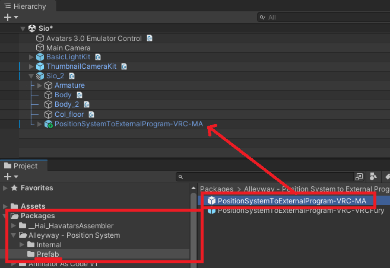
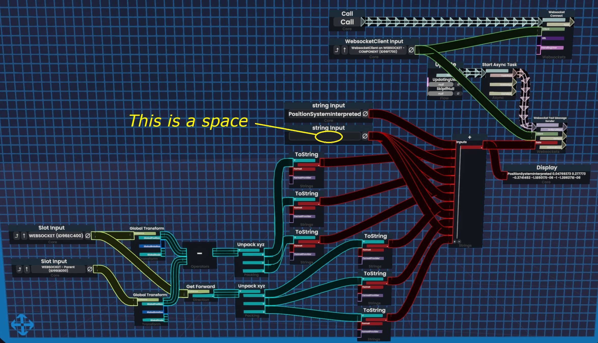

import {HaiTags} from "/src/components/HaiTags";
import {HaiTag} from "/src/components/HaiTag";
import {HaiVideo} from "/src/components/HaiVideo";

# Set up the avatar

:::tip
Only the **computer connected** to the robotic arm needs the software and the prefab. The other users in the virtual space do not need it,
they just need a standard DPS-like light.

If they already have a standard DPS-like light such as SPS, then they can control your robotic arm, no additional setup needed from them.
:::

Choose one of the sections below depending on your platform or application:
- [**VRChat** Avatars SDK using Modular Avatar](#vrchat-avatars-sdk-using-modular-avatar)
- [**VRChat** Avatars SDK using VRCFury](#vrchat-avatars-sdk-using-vrcfury)
- [**Resonite**](#resonite)
- [**ChilloutVR**](#chilloutvr)
- [Applications built using the **Basis** framework](#applications-built-using-the-basis-framework)

## VRChat Avatars SDK using Modular Avatar

<HaiTags>
<HaiTag requiresVRChat={true} short={true} />
</HaiTags>

:::info
If you have Modular Avatar, this is the recommended method. If you do not have Modular Avatar, but you have VRCFury, [see the other section below](#vrchat-avatars-sdk-using-vrcfury). 
**You must have at least one of those two.**

*Also, SPS lights are DPS-like lights. They will work with this position system.*
:::

In the avatar:
- In the *Project* tab, open the *Packages/Alleyway - Position System/Prefabs/* folder.
- Add the *PositionSystem-VRC-MA* prefab to your avatar root.

You may customize the setup further, the following steps are optional:
- You can rescale the *System* object. The length of the yellow rods is approximately the total travel length of the robotic arm.
- If you want to change the menu location, there is an *MA Menu Installer* component in `(prefab)/System`
- By default, the calibration origin will be on the right hand.
    - You can choose to switch it to your left hand using the *Armature Link* component located on `(prefab)/System/HandRoot`.
    - It is not obvious whether you should define it as your dominant or non-dominant hand. Personally, I have it set up to my dominant hand.
    - Its child object *HandPalmDown* will be hovering under your palm, approximately at two hands' distance to your hand.

If you use an avatar optimization tool that merges meshes, exclude this object:
- `(prefab)/System/CalibrationConstraint/LocalOnly-Toggled/Parent-ReferenceScale/Parent-Rescaled/PStoEP-Encoder`
- This mesh is special and must not be converted or simplified.

## VRChat Avatars SDK using VRCFury

<HaiTags>
<HaiTag requiresVRChat={true} short={true} />
</HaiTags>

:::note
I don't use VRCFury for my own projects, and I am not familiar enough with its components. Nevertheless, I have tentatively built the VRCFury prefab
based on the Modular Avatar prefab using equivalent components.

However, I cannot guarantee that the VRCFury prefab has been set up correctly.

*Also, SPS lights are DPS-like lights. They will work with this position system.*
:::

In the avatar:
- In the *Project* tab, open the *Packages/Alleyway - Position System/Prefabs/* folder.
- Add the *PositionSystem-VRC-VRCFury* prefab to your avatar root.

You may customize the setup further, the following steps are optional:
- You can rescale the *System* object. The length of the yellow rods is approximately the total travel length of the robotic arm.
- If you want to change the menu location, there is a *Full Controller* component in  `(prefab)/System/MA-MenuInstaller`
- By default, the calibration origin will be on the right hand.
    - You can choose to switch it to your left hand using the *Armature Link* component located on `(prefab)/System/HandRoot`.
    - It is not obvious whether you should define it as your dominant or non-dominant hand. Personally, I have it set up to my dominant hand.
    - Its child object *HandPalmDown* will be hovering under your palm, approximately at two hands' distance to your hand.

If you use an avatar optimization tool that merges meshes, exclude this object:
- `(prefab)/System/CalibrationConstraint/LocalOnly-Toggled/Parent-ReferenceScale/Parent-Rescaled/PStoEP-Encoder`
- This mesh is special and must not be converted or simplified.

## VRChat Worlds SDK

:::danger
🚫 **We advise against integrating the shader data encoder system in worlds.**

This is because the shader material may need to be customized by the user to fix alignment issues within the HMD.
:::

There is no support for worlds. However, consider the following:

DPS-like lights are not limited to avatars. If you want a world to control a robotic arm, you may be able
to use the same DPS-like light setup.

Also, we support [WebSockets](https://github.com/hai-vr/position-system-to-external-program/?tab=readme-ov-file#websockets-as-an-alternative-input-system);
If you're building a world for yourself, you could also create a log parser that submits commands to the WebSocket.

## Resonite

<HaiTags>
<HaiTag requiresResonite={true} short={true} />
</HaiTags>

Resonite has support for WebSockets, which can be used to extract a position and normal.

Create a *WebsocketClient* component in an object. Use a *Websocket Text Message Sender* node to send a text message.
- The text message string needs to be formatted as specified in the [WebSockets](https://github.com/hai-vr/position-system-to-external-program/?tab=readme-ov-file#websockets-as-an-alternative-input-system) documentation.
- Pass a position (e.g., local transform, or global transform) in a given coordinate space.
- Pass a direction (e.g., something like Up or Forward direction) in the same coordinate space as the position.
- *Optionally, you can also pass a tangent (e.g., something like Up or Forward direction), which should be perpendicular to the direction. We don't use that information yet, but this could be later used to control the twist.*

When using the software, [you will need to enable the WebSockets service as it is OFF by default](developer#websockets).

We do not currently provide a readily usable ProtoFlux item at this time. Use the picture below as a reference for a possible implementation.

:::note
If you're reading this, you probably have better knowledge of ProtoFlux than I do, so if you see obvious mistakes in that blueprint,
don't copy it.

For example, this should only run on the computer connected to the robotics arm, but this graph does not currently restrict it.
:::

## ChilloutVR

<HaiTags>
<HaiTag requiresChilloutVR={true} short={true} />
</HaiTags>

:::danger
The ChilloutVR prefab is not currently working properly. There's some kind of issue with merging the animator controller.

Here are the instructions:
:::

A prefab has been tentatively added.

- In the *Project* tab, open the *Packages/Alleyway - Position System/Prefabs/* folder.
- Add the *PositionSystem-ChilloutVR* prefab to your avatar root.
- It **must** be at the avatar root. **Do not rename** the prefab object. The animations depend on it.

In you want to unpack the prefab:
- Unpack the prefab.
- Move the HandRoot and NeckRoot objects to your hand bone\* and neck bone respectively.
  - It is not obvious whether you should assign the HandRoot to your dominant or non-dominant hand. Personally, I have it set up to my dominant hand.
  - Its child object *HandPalmDown* will be hovering under your palm, approximately at two hands' distance to your hand.
- Set their local position to zero.

:::note
If you want to do this without unpacking the prefab, then do the following instead:
- **Create a duplicate of** the HandRoot and NeckRoot objects to your hand bone and neck bone respectively.
  - It is not obvious whether you should assign the HandRoot to your dominant or non-dominant hand. Personally, I have it set up to my dominant hand.
  - Its child object *HandPalmDown* will be hovering under your palm, approximately at two hands' distance to your hand.
- Set their local position to zero.
- In the prefab, locate the `(prefab)/System/CalibrationConstraint`.
- In the *Position Constraint* component, reassign the constraint source to your new HandRoot object.
- In the *Aim Constraint* component, reassign the constraint source to your new NeckRoot object.
:::

Set up your animator:
- In the Project view, go to `Packages/Alleyway - Position System/Internal/App-ChilloutVR/AbsolutePaths/`
- Open the `PositionSystem-Animator-CVR-Absolute.controller` animator controller asset file,
- Copy the two layers to your own animator, including the parameters and the value of the parameters **(TODO: How to do this???)**.

Set up your *CVR Avatar* component:
- In Advanced Settings:
  - Add a Toggle of type Float called *Enabled* that toggles the parameter `PStoEP_Enabled`
  - Add a Toggle of type Float called *Enabled and Visible* that toggles the parameter `PStoEP_EnabledAndVisible`
  - Add a Toggle of type Float called *Bring to Hand* that toggles the parameter `PStoEP_BringToHand`

Optionally:
- You can rescale the *System* object. The length of the yellow rods is approximately the total travel length of the robotic arm.

:::info[Additional information for advanced ChilloutVR users]
*If you are more familiar with ChilloutVR, please reach out on the [temporary Alleyway Discord server](https://discord.gg/3VzveJQYWE).*

The following will give you an insight of how to convert this prefab.

Object structure:
- Make `(prefab)/System/HandRoot` reparented to one of your hands, which will be used for calibrating the origin.
    - It is not obvious whether you should define it as your dominant or non-dominant hand. Personally, I have it set up to my dominant hand.
    - Its child object *HandPalmDown* will be hovering under your palm, approximately at two hands' distance to your hand.
- Make `(prefab)/System/NeckRoot` reparented to your neck bone.

Component manipulation/Animation:
- The encoder mesh that uses the shader needs to be visible only to the person who has the computer connected to the robotic arm (avatar wearer,
  or the user who spawned the item).
- There are constraints that have been converted to Unity systems, along with its animations. The animation logic is different in ChilloutVR because it is using the world object prefab trick.

If you can modify ChilloutVR, you may also look into using [WebSockets](https://github.com/hai-vr/position-system-to-external-program/?tab=readme-ov-file#websockets-as-an-alternative-input-system).
:::

## Applications built using the Basis framework

<HaiTags>
<HaiTag requiresBasis={true} short={true} />
</HaiTags>

Since Basis projects allow modification, the easiest way is **not** to use data extraction through pixels on the screen.

Use [WebSockets](https://github.com/hai-vr/position-system-to-external-program/?tab=readme-ov-file#websockets-as-an-alternative-input-system) instead.