---
sidebar_position: 50
---
# Robotics settings

The Robotics settings let you customize the behavior of your robotic arm during use.

Depending on what you're doing, you may have to tweak those settings live.

## Virtual scale

The virtual scale changes the amount of movement required in the virtual space to produce the same amount
of movement in the physical space, where 1 is the default.

If you use the prefab, the scale of 1 is the height of the vertical rod from the bottom face.

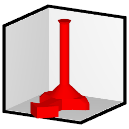
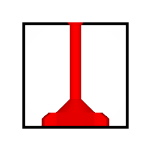

> A value of 0.5 means you will need to move half the height in the virtual space to move the total height in the physical space:
> 
> 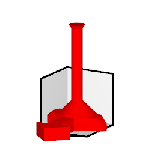

> A value of 2 means you will need to move twice the height in the virtual space to move the total height in the physical space:
>
> 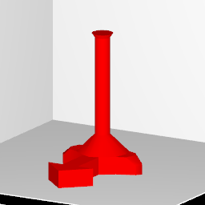
> 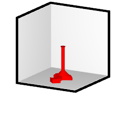

:::tip
Lowering the value will require less physical effort in the virtual space for the robotic arm to travel the total height in the physical space.
:::

## Hard limits

The hard limits **lower the maximum and minimum height** that the robotic arm is authorized to move.

When this value is changed, the virtual scale and offset are internally compensated so that it still takes the full travel
in the virtual space to move in the range between the hard limits. This can be disabled using the *Compensate virtual scale* checkbox.

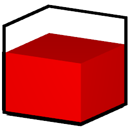

:::tip
It is recommended to lower the maximum height if you think that the robotic arm travels too high.
Another option is to physically move the robotic arm anchor point lower, and then increase the minimum height.

If your robotic arm bottoms out too early, then you may physically tweak your robotic arm anchor point so that it is higher, or increase the minimum height.
:::

## Offsets

The offset lets you tweak the pitch angle of the robotic arm after the position is applied.

This does not change the direction of movement. A movement in the virtual space will lead to the same direction in the physical space.

## Safety settings

:::warning
Changing these settings can lead to unusual motions for the robotic arm. Use with caution.
:::

### Limit movement at the bottom

This safety setting is designed for robotic arms capable of moving laterally.

The *Limit movement at the bottom* setting does the following.
- It confines the lateral movement of the robotic arm to a circle.
- The radius of that circle is 100% radius if the robotic arm were to be at the topmost height capable by the machine.
- The radius of that circle is 40% radius if the robotic arm were to be at the bottommost height capable by the machine.

This limits the movement of the robotic arm to a truncated cone shape, pointing down.

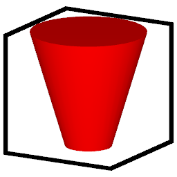

This setting is ON by default. If you uncheck this setting, the robotic arm will be able to move the full range.

:::note
The shape of this cone does not get squished when you lower the hard limit, so it remains safe even with a lower limit.

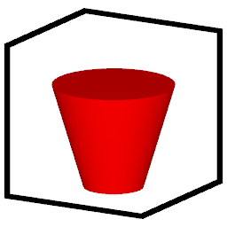
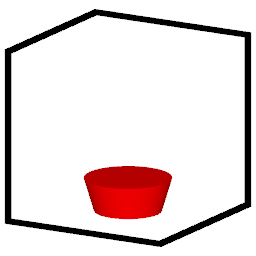
:::

## Twist

If you own a device that supports a twist axis: Unfortunately, DPS-like lights only support position and direction information;
it does not have rotation information along the direction axis.

This means we can't have *true "twist"*. Instead, there is are simulated twist settings:

- The *Simulated twist from Roll* will add twist based on how much the direction leans sideways.
- The *Simulated twist from Lateral* will add twist based on how much the position is laterally away from the center.

The slider controls how much these influence the twist. You can set a negative number to twist in the opposite direction.

You can combine both simulated twist from Roll and Lateral.

## Rotate machine

:::warning
This setting is located in the **Robotics (Advanced)** tab, because it is one of the most disruptive settings;
The virtual space and the physical space will no longer agree on the directions.

If you think something is strange with the machine behavior, press the Reset button. This will set the rotation back to 0.
:::

When using the Rotate machine setting, the movement in the virtual space in one direction will result in a different direction in the physical space.

- This can turn a horizontal motion in the virtual space to a vertical motion in the physical space.
- Alternatively, if you use a robotic arm which is oriented horizontally, using this setting can correct the space so that the virtual space and physical space match.

> A value of 90 pitches the machine 90 degrees.
> - If your robotic arm is oriented vertically, a motion in the virtual space towards you will equate to motion in the physical space downwards (directions in space no longer match).
> - If your robotic arm is oriented horizontally, a motion in the virtual space towards you will also equate to motion in the physical space towards you (direction in spaces match).
> 
> 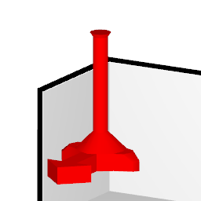
> 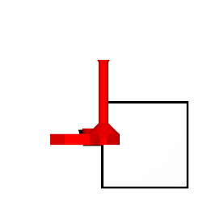
> 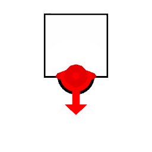
