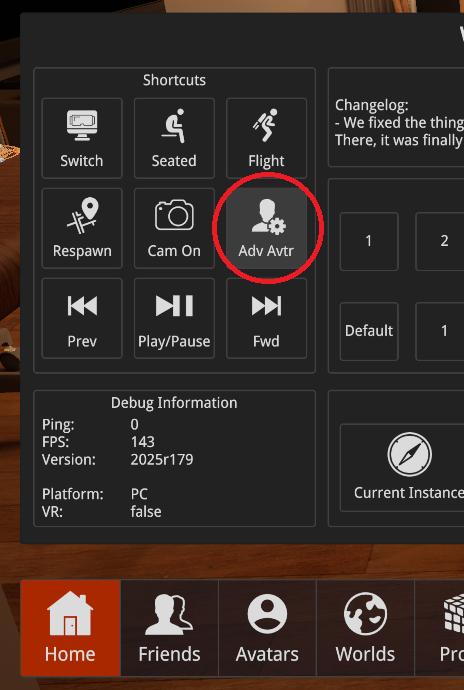

---
sidebar_position: 45
---
import {HaiTags} from "/src/components/HaiTags";
import {HaiTag} from "/src/components/HaiTag";
import {HaiVideo} from "/src/components/HaiVideo";

# Use the prefab

<HaiTags>
<HaiTag requiresVRChat={true} short={true} /><HaiTag requiresChilloutVR={true} short={true} />
</HaiTags>

Once you have [correctly calibrated once](first-time-calibration) and [connected the robotic arm](connect), here's how to use the prefab.

- The **Enabled** toggle in the menu enables the system.
- The **Enabled and Visible** toggle in the menu enables the system and makes the red calibration arrow visible to other users.
- Hold down the **Bring to Hand** menu button to change the lowest-center point of the robotic arm.
  - When you release the menu button, keep your hand still for a second so that the world position syncs properly to other users.
  - If you're not in *Enabled and Visible* mode, the red calibration arrow will only be visible to you.

## VRChat

In <HaiTag requiresVRChat={true} short={true} />, use the **Expressions Menu**.

## ChilloutVR

In <HaiTag requiresChilloutVR={true} short={true} />, use the **Adv Avtr** button in the main large menu.

